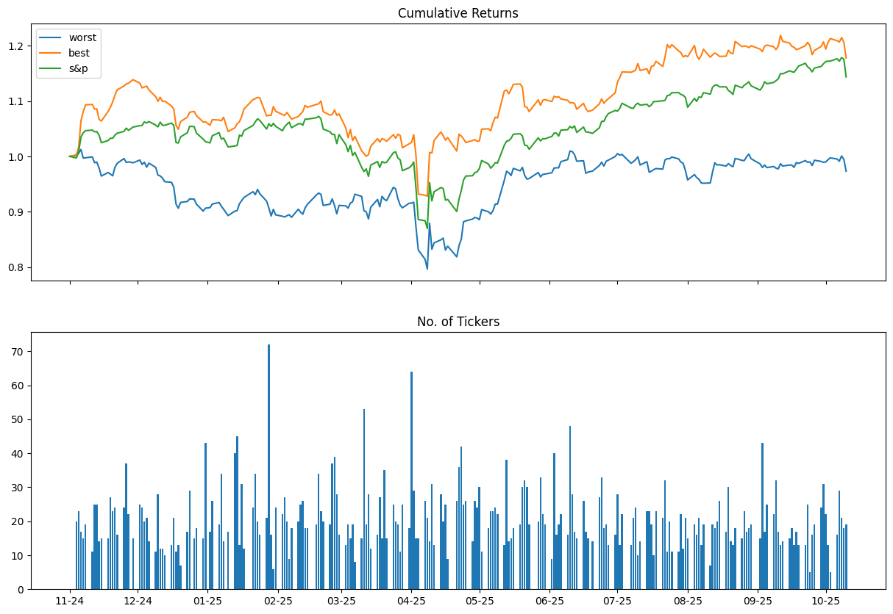

# Antbear.ai S&P 500 Predictor 

## Introduction

This Github project uses 10 models evolved using [Antbear.ai](https://antbear.ai) Genetic Programming to predict which S&P 500 stocks will do well and which ones will do badly on a day-to-day basis. The S&P 500 performance is also included as a benchmark.  The No. of Tickers graph is the total number of tickers used for the best performance.

## Warning

***This is intended as a purely academic exercise to illustrate how one can use [Antbear.ai](https://antbear.ai) models from within the Python environment.  Please do not use this to gamble on the stock exchange! The responsibility for any loss is yours and yours alone!***

## Instructions

1. Clone the repository.
2. Run the data analysis Juptyer notebook to generate daily predictions.
3. Run the profit analysis Jupyter notebook to view prediction performance.
